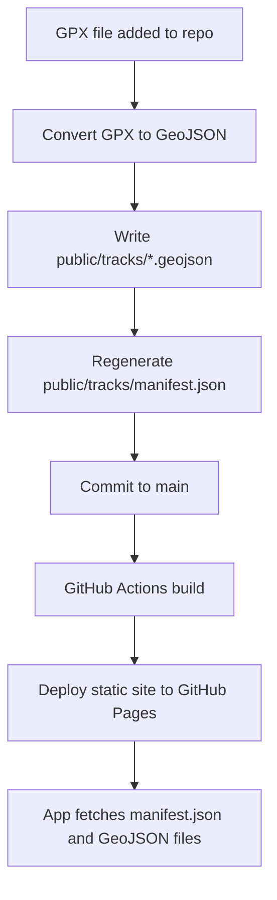
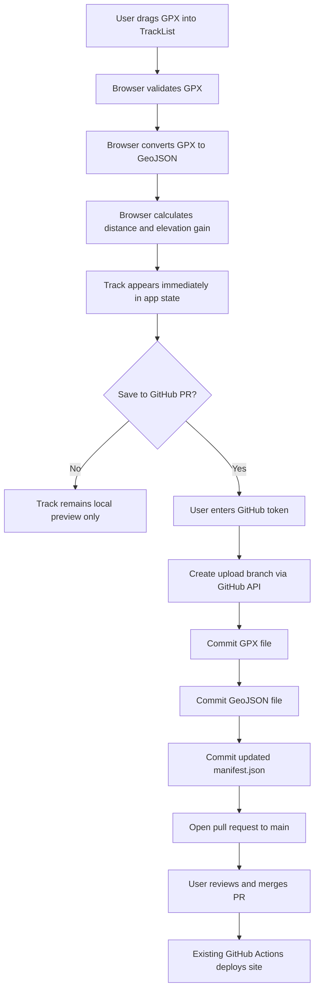
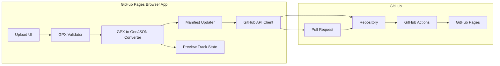
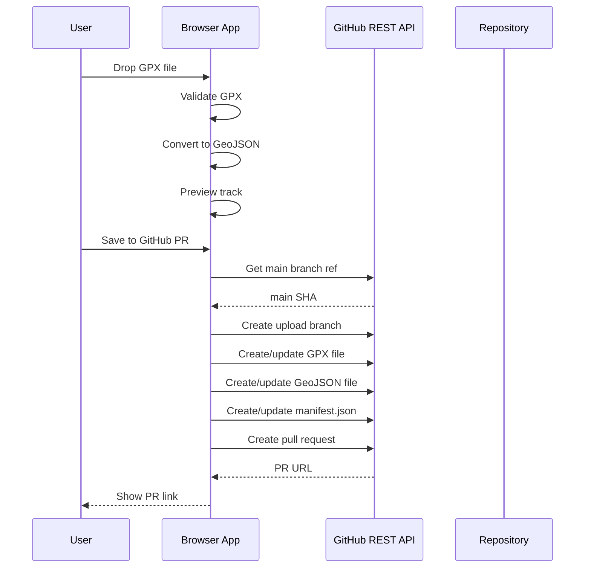
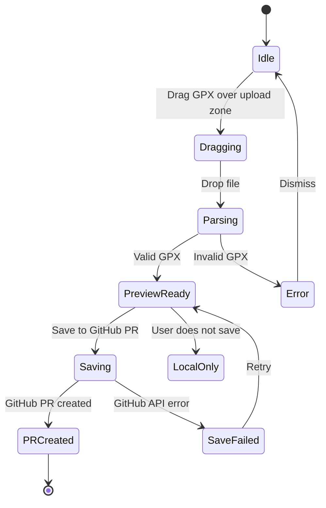

# GPX Upload to GitHub PR Pipeline Plan

**Plan date:** April 27, 2026  
**App:** Trail Explorer / `trail-viewer`  
**Deployment model:** Static GitHub Pages site deployed by GitHub Actions  
**Primary user case:** As the repo owner, I want to drag and drop a new GPX file into the deployed app, preview it immediately, convert it to GeoJSON, and save it back into the app's normal static track pipeline by opening a GitHub pull request.

## What We Discussed

The app is currently static and deployed from GitHub via `.github/workflows/deploy.yml`. It builds with Vite and publishes `dist` to GitHub Pages.

The app currently loads tracks from `public/tracks/manifest.json`. Each manifest entry is turned into a lightweight track stub. When a user selects a track, the app fetches the matching GeoJSON file from `public/tracks/`. GPX downloads are served from `public/tracks/gpx/`.

Because GitHub Pages is static, the deployed browser app cannot directly write files into `public/tracks/` or update `manifest.json` on the server. To persist uploaded GPX files, the app needs to call an external write mechanism. The chosen approach is to use the GitHub REST API from the browser to create a branch, commit the GPX/GeoJSON/manifest changes, and open a pull request.

Decisions made:

- Persistence target: GitHub pull request.
- Auth model: just the repo owner, using a fine-grained GitHub token entered into the app.
- Conversion location: in the browser.
- GitHub Pages deployment remains unchanged.
- GitHub Actions deploys only after the PR is merged to `main`.

## Current Pipeline



Current relevant behavior:

- `src/App.jsx` fetches `tracks/manifest.json`.
- Manifest entries become lightweight track stubs.
- Selecting a track fetches the matching GeoJSON from `public/tracks/`.
- GPX downloads use `public/tracks/gpx/<filename>.gpx`.
- Existing scripts already define the local pipeline:
  - Validate GPX.
  - Convert GPX to GeoJSON.
  - Generate `manifest.json`.

## Proposed Upload Pipeline



## Architecture



## Detailed User Flow

1. User opens the deployed GitHub Pages app.
2. User drags a `.gpx` file into a new upload area in the track list.
3. Browser validates that:
   - File extension is `.gpx`.
   - XML parses successfully.
   - A `<gpx>` root exists.
   - The file has `<trkpt>` or `<rtept>` points.
4. Browser converts GPX to GeoJSON.
5. Browser calculates:
   - Distance in miles.
   - Elevation gain in feet.
6. Browser creates a temporary in-memory track and appends it to the current track list.
7. User can select the uploaded track and view it on the map before saving.
8. User clicks "Save to GitHub PR".
9. App asks for a fine-grained GitHub token.
10. App uses GitHub API to:
    - Read the current `main` branch SHA.
    - Create a new upload branch.
    - Write the GPX file.
    - Write the generated GeoJSON file.
    - Write updated `manifest.json`.
    - Open a pull request.
11. User reviews the PR on GitHub.
12. User merges the PR.
13. Existing GitHub Actions workflow deploys the updated static site.

## GitHub Token Requirements

Use a fine-grained personal access token scoped only to this repository.

Required permissions:

- `Contents: Read and Write`
- `Pull requests: Read and Write`

Token handling:

- Do not commit the token.
- Do not embed the token in the app.
- Do not expose the token through GitHub Actions secrets for browser use.
- Store the token only in memory or `sessionStorage`.
- Provide a "clear token" action.

## Files to Add or Change

Primary frontend changes:

- Add an upload component to the track list area.
- Add browser-side GPX parsing/conversion utilities.
- Add browser-side manifest update logic.
- Add a GitHub API client for branch, commit, and PR creation.
- Wire uploaded tracks into existing app state so they can be previewed immediately.

Likely implementation targets:

- `src/components/TrackList.jsx`
- `src/App.jsx`
- New utility module for GPX conversion.
- New utility module for GitHub API calls.
- Tests under `test/`.

The implementation should reuse existing app behavior where possible:

- Use the same distance/elevation utility logic already used by the app.
- Match the filename slug behavior from `scripts/add-track.cjs`.
- Match manifest shape from `public/tracks/manifest.json`.

## Data Written to the Pull Request

For an uploaded GPX named `ChaneytoWilsonBigLoop23.gpx`, the PR should add or update:

```text
public/tracks/gpx/chaneytowilsonbigloop23.gpx
public/tracks/chaneytowilsonbigloop23.geojson
public/tracks/manifest.json
```

If a filename collision exists, append a timestamp suffix:

```text
public/tracks/gpx/chaneytowilsonbigloop23-20260427-153000.gpx
public/tracks/chaneytowilsonbigloop23-20260427-153000.geojson
```

Manifest entry format:

```json
{
  "file": "chaneytowilsonbigloop23.geojson",
  "name": "ChaneytoWilsonBigLoop23",
  "location": "",
  "description": "",
  "distance": 23.42,
  "elevationGain": 5200
}
```

## GitHub API Sequence



## Error Handling

Handle these cases clearly:

- Invalid file type.
- Invalid XML.
- Missing GPX root.
- GPX has no usable track or route points.
- GPX has no elevation data.
- GitHub token missing.
- GitHub token lacks permissions.
- Branch creation fails.
- File commit fails.
- PR creation fails.
- Filename collision occurs.

Important behavior:

- If GitHub save fails, keep the uploaded track available in the current browser session.
- Do not silently discard a successfully parsed upload.
- Show the user whether the track is:
  - Local preview only.
  - PR created.
  - Save failed.

## UI States



## Acceptance Criteria

The feature is complete when:

- A `.gpx` file can be dragged into the deployed app.
- The file is converted to GeoJSON in the browser.
- The uploaded track appears in the track list without reloading the page.
- The uploaded track can be selected and viewed on the map.
- Distance and elevation gain display for the uploaded track.
- A GitHub PR can be created from the browser using a user-provided token.
- The PR contains:
  - Original GPX file.
  - Generated GeoJSON file.
  - Updated manifest.
- Merging the PR triggers the existing GitHub Actions deployment.
- After deployment, the track loads like all other static tracks.

## Test Plan

Automated tests:

- Valid GPX converts to GeoJSON.
- Invalid XML fails validation.
- GPX without track points fails validation.
- GPX without elevation still converts but reports zero or missing elevation gain.
- Filename slug generation matches expected repo style.
- Filename collision appends timestamp suffix.
- Manifest update adds exactly one track entry.
- Manifest entries sort consistently with existing behavior.
- GitHub API client builds correct file paths and PR payloads.

Manual tests:

- Drag a real GPX file into the deployed app.
- Confirm preview track appears immediately.
- Select preview track and verify map rendering.
- Save to GitHub PR with a valid token.
- Open the generated PR and confirm file diffs.
- Merge PR and confirm GitHub Actions deploys.
- Reload deployed site and confirm new track is present.

Failure manual tests:

- Drop a `.txt` file.
- Drop a malformed `.gpx`.
- Try saving without a token.
- Try saving with a token lacking repo permissions.
- Try uploading a GPX whose filename already exists.

## Security Notes

This approach is acceptable for personal use because the token belongs to the repo owner and is entered manually.

It is not appropriate for public anonymous uploads because anyone with a write-capable token can modify repository contents. If public uploads are ever needed, replace the browser-token flow with a backend, GitHub App, or moderation queue.

## Out of Scope for This Version

Not included in v1:

- Public anonymous upload support.
- Auto-merge.
- Server-side database.
- Replacing GitHub Actions deployment.
- Multi-user approval workflow beyond GitHub PR review.
- Editing track metadata after upload, except basic generated defaults.

## Implementation Assumptions

- The app remains a static GitHub Pages app.
- The user is the repository owner or has permission to create branches and PRs.
- The existing GitHub Actions workflow remains the deployment mechanism.
- The browser conversion should match the current local conversion pipeline closely enough that generated tracks behave like existing ones.
- The first valid GPX track feature is sufficient for v1.
