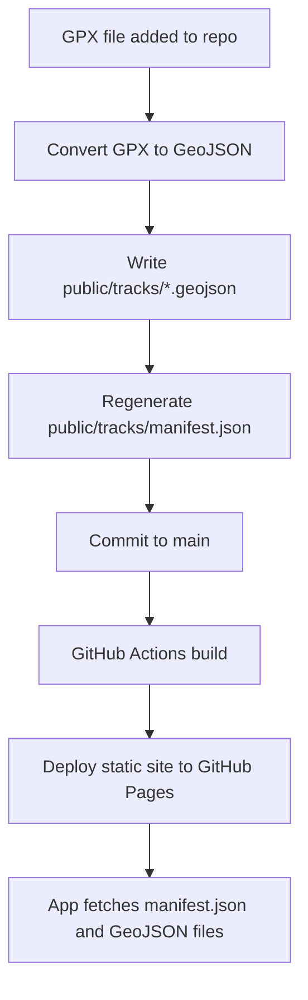
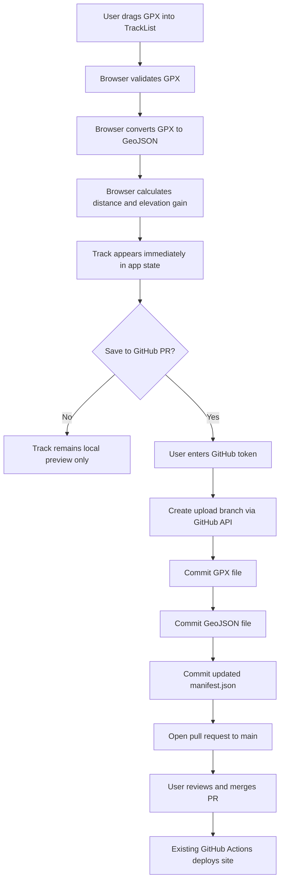
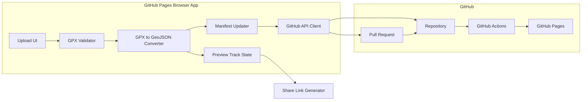
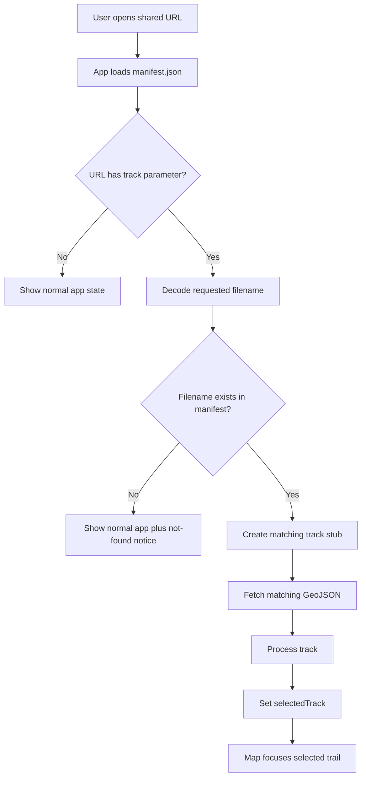
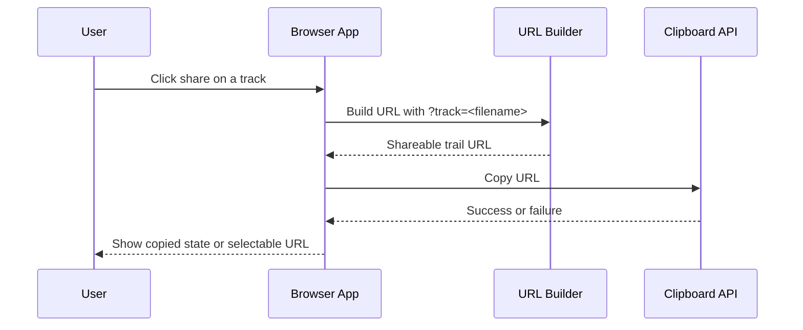
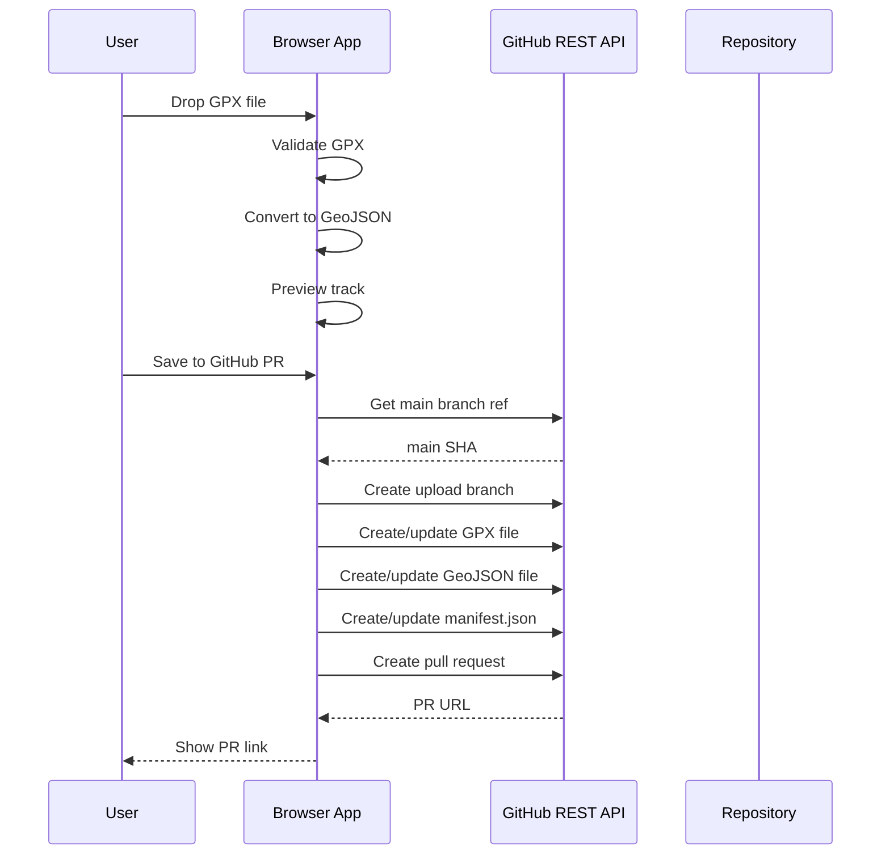
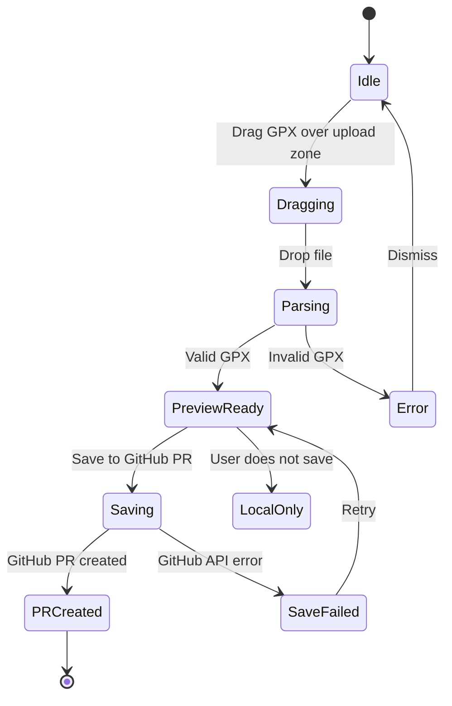
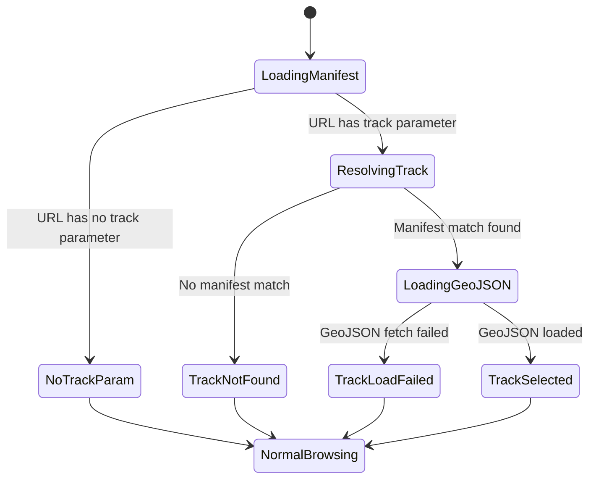

# GPX Upload to GitHub PR Pipeline Plan

**Plan date:** April 27, 2026  
**App:** Trail Explorer / `trail-viewer`  
**Deployment model:** Static GitHub Pages site deployed by GitHub Actions  
**Primary user case:** As the repo owner, I want to drag and drop a new GPX file into the deployed app, preview it immediately, convert it to GeoJSON, and save it back into the app's normal static track pipeline by opening a GitHub pull request.

## What We Discussed

The app is currently static and deployed from GitHub via `.github/workflows/deploy.yml`. It builds with Vite and publishes `dist` to GitHub Pages.

The app currently loads tracks from `public/tracks/manifest.json`. Each manifest entry is turned into a lightweight track stub. When a user selects a track, the app fetches the matching GeoJSON file from `public/tracks/`. GPX downloads are served from `public/tracks/gpx/`.

Because GitHub Pages is static, the deployed browser app cannot directly write files into `public/tracks/` or update `manifest.json` on the server. To persist uploaded GPX files, the app needs to call an external write mechanism. The chosen approach is to use the GitHub REST API from the browser to create a branch, commit the GPX/GeoJSON/manifest changes, and open a pull request.

Decisions made:

- Persistence target: GitHub pull request.
- Auth model: just the repo owner, using a fine-grained GitHub token entered into the app.
- Conversion location: in the browser.
- Sharing model: generate a URL that opens the app directly to a specific trail, so recipients do not need to search the track list.
- GitHub Pages deployment remains unchanged.
- GitHub Actions deploys only after the PR is merged to `main`.

## Current Pipeline



Current relevant behavior:

- `src/App.jsx` fetches `tracks/manifest.json`.
- Manifest entries become lightweight track stubs.
- Selecting a track fetches the matching GeoJSON from `public/tracks/`.
- GPX downloads use `public/tracks/gpx/<filename>.gpx`.
- Existing scripts already define the local pipeline:
  - Validate GPX.
  - Convert GPX to GeoJSON.
  - Generate `manifest.json`.

## Proposed Upload Pipeline



## Architecture



## Detailed User Flow

1. User opens the deployed GitHub Pages app.
2. User drags a `.gpx` file into a new upload area in the track list.
3. Browser validates that:
   - File extension is `.gpx`.
   - XML parses successfully.
   - A `<gpx>` root exists.
   - The file has `<trkpt>` or `<rtept>` points.
4. Browser converts GPX to GeoJSON.
5. Browser calculates:
   - Distance in miles.
   - Elevation gain in feet.
6. Browser creates a temporary in-memory track and appends it to the current track list.
7. User can select the uploaded track and view it on the map before saving.
8. User clicks "Save to GitHub PR".
9. App asks for a fine-grained GitHub token.
10. App uses GitHub API to:
    - Read the current `main` branch SHA.
    - Create a new upload branch.
    - Write the GPX file.
    - Write the generated GeoJSON file.
    - Write updated `manifest.json`.
    - Open a pull request.
11. User reviews the PR on GitHub.
12. User merges the PR.
13. Existing GitHub Actions workflow deploys the updated static site.
14. After deployment, the app can generate a stable share URL for the trail.
15. A recipient opening that URL lands directly on the selected trail instead of needing to search.

## Trail-Specific Share URLs

This is possible with the current static GitHub Pages architecture. The app can encode the selected trail in the URL, then read that URL on startup and automatically select the matching track from `manifest.json`.

The URL should identify a trail by a stable manifest-backed value, not by transient React state. The recommended identifier is the GeoJSON filename because every deployed track already has a unique `file` value in `public/tracks/manifest.json`.

Recommended URL format:

```text
https://<site-base-url>/?track=<encoded-geojson-filename>
```

Example:

```text
https://spaceshiptrip.github.io/trail-viewer/?track=chaneytowilsonbigloop23.geojson
```

Alternative hash format if query parameters cause GitHub Pages routing issues:

```text
https://<site-base-url>/#track=<encoded-geojson-filename>
```

The query parameter format should be the default because this is a Vite single-page app served from GitHub Pages and does not require server-side route handling. The app should avoid path-style routes such as `/trail/chaneytowilsonbigloop23` unless GitHub Pages fallback routing is explicitly configured.

### Deep Link Behavior

On initial app load:

1. Fetch `tracks/manifest.json`.
2. Build the existing track stubs.
3. Read the URL parameter:
   - Preferred: `track` query parameter.
   - Fallback: `track` hash parameter if implemented.
4. Decode the requested filename.
5. Find the manifest entry whose `file` exactly matches the decoded value.
6. If found, load that track's GeoJSON using the existing `loadTrackGeoJSON` path.
7. Set it as the selected track.
8. Open the sidebar/details view for that selected track.
9. Keep the track list available, but the user should not have to search.

If no matching track is found:

- Load the app normally.
- Show a non-blocking message such as: `Shared trail was not found. It may not be deployed yet.`
- Do not fail the entire app.

### Share Link UI

Add a share action to each track after it is available in the manifest.

Recommended UI placement:

- Add a share icon button next to the existing GPX download button in each track card.
- Add the same share action in the selected track/sidebar view if that is more discoverable after a trail is selected.

Recommended behavior:

1. User clicks the share button.
2. App generates a URL using the current site origin, Vite base path, and the selected track's `properties.filename`.
3. App copies the URL to the clipboard using `navigator.clipboard.writeText`.
4. App shows a small success state such as `Link copied`.
5. If clipboard permissions fail, show the URL in a selectable text field.

Share links should only be presented as stable public links for tracks that exist in the deployed manifest. For newly uploaded local-preview tracks:

- Before the PR is created, the app may show `Share link available after saving and deployment`.
- After the PR is created but before merge/deploy, the app may show the future share URL but label it clearly as `Available after PR merge and deployment`.
- After deployment, the same URL becomes valid because the filename will exist in `manifest.json`.

### Deep Link State Flow



### Share Link Generation Flow



### URL Encoding Rules

The app must URL-encode the filename when generating links.

Examples:

```text
MtWilson_Occidental_Disappointment_Lowe_12.geojson
```

becomes:

```text
?track=MtWilson_Occidental_Disappointment_Lowe_12.geojson
```

and a filename with spaces:

```text
Big Dalton Glendora Trail 10.geojson
```

becomes:

```text
?track=Big%20Dalton%20Glendora%20Trail%2010.geojson
```

When reading the URL, decode the value before comparing it against manifest entries.

### Browser History Behavior

When the user manually selects a track from the list, update the URL to include that selected track:

```text
?track=<encoded-geojson-filename>
```

Use `window.history.pushState` or React-equivalent navigation behavior so browser back/forward navigation remains useful:

- Selecting a different track updates the URL.
- Pressing the browser back button returns to the previous selected track if the prior history entry had a track parameter.
- Closing the selected trail can remove the `track` parameter and return to the default app URL.

This should be implemented carefully to avoid an infinite loop between URL updates and selection state updates.

### Interaction With Uploaded Tracks

Uploaded tracks have two phases:

1. **Local preview phase**
   - Track exists only in browser memory.
   - It should not get a public share URL because another user cannot load it.
   - UI should say the trail must be saved and deployed before sharing.

2. **Persisted/deployed phase**
   - PR has been merged.
   - GitHub Actions has deployed the updated `manifest.json`, GeoJSON, and GPX.
   - The app can generate a stable URL using the final GeoJSON filename.

The PR creation success message should include the future share URL, but it must label it clearly:

```text
Future share URL, available after this PR is merged and deployed:
https://<site-base-url>/?track=<encoded-geojson-filename>
```

## GitHub Token Requirements

Use a fine-grained personal access token scoped only to this repository.

Required permissions:

- `Contents: Read and Write`
- `Pull requests: Read and Write`

Token handling:

- Do not commit the token.
- Do not embed the token in the app.
- Do not expose the token through GitHub Actions secrets for browser use.
- Store the token only in memory or `sessionStorage`.
- Provide a "clear token" action.

## Files to Add or Change

Primary frontend changes:

- Add an upload component to the track list area.
- Add browser-side GPX parsing/conversion utilities.
- Add browser-side manifest update logic.
- Add a GitHub API client for branch, commit, and PR creation.
- Wire uploaded tracks into existing app state so they can be previewed immediately.
- Add trail-specific URL deep linking using a `track` query parameter.
- Add share link generation/copy UI for deployed tracks.

Likely implementation targets:

- `src/components/TrackList.jsx`
- `src/App.jsx`
- New utility module for GPX conversion.
- New utility module for GitHub API calls.
- Tests under `test/`.

The implementation should reuse existing app behavior where possible:

- Use the same distance/elevation utility logic already used by the app.
- Match the filename slug behavior from `scripts/add-track.cjs`.
- Match manifest shape from `public/tracks/manifest.json`.
- Use existing manifest `file` values as stable share-link identifiers.

## Data Written to the Pull Request

For an uploaded GPX named `ChaneytoWilsonBigLoop23.gpx`, the PR should add or update:

```text
public/tracks/gpx/chaneytowilsonbigloop23.gpx
public/tracks/chaneytowilsonbigloop23.geojson
public/tracks/manifest.json
```

If a filename collision exists, append a timestamp suffix:

```text
public/tracks/gpx/chaneytowilsonbigloop23-20260427-153000.gpx
public/tracks/chaneytowilsonbigloop23-20260427-153000.geojson
```

Manifest entry format:

```json
{
  "file": "chaneytowilsonbigloop23.geojson",
  "name": "ChaneytoWilsonBigLoop23",
  "location": "",
  "description": "",
  "distance": 23.42,
  "elevationGain": 5200
}
```

## GitHub API Sequence



## Error Handling

Handle these cases clearly:

- Invalid file type.
- Invalid XML.
- Missing GPX root.
- GPX has no usable track or route points.
- GPX has no elevation data.
- Shared URL references a track that is not in the deployed manifest.
- Shared URL has a malformed or undecodable `track` parameter.
- Clipboard API is unavailable or blocked when copying a share URL.
- GitHub token missing.
- GitHub token lacks permissions.
- Branch creation fails.
- File commit fails.
- PR creation fails.
- Filename collision occurs.

Important behavior:

- If GitHub save fails, keep the uploaded track available in the current browser session.
- Do not silently discard a successfully parsed upload.
- Show the user whether the track is:
  - Local preview only.
  - PR created.
  - Save failed.
- Do not offer a normal public share link for local-only uploaded tracks.
- Future share links for PR-created tracks must be labeled as unavailable until merge and deployment.

## UI States



## Deep Link UI States



## Acceptance Criteria

The feature is complete when:

- A `.gpx` file can be dragged into the deployed app.
- The file is converted to GeoJSON in the browser.
- The uploaded track appears in the track list without reloading the page.
- The uploaded track can be selected and viewed on the map.
- Distance and elevation gain display for the uploaded track.
- A GitHub PR can be created from the browser using a user-provided token.
- The PR contains:
  - Original GPX file.
  - Generated GeoJSON file.
  - Updated manifest.
- Merging the PR triggers the existing GitHub Actions deployment.
- After deployment, the track loads like all other static tracks.
- Each deployed track has a share action that generates a URL directly to that track.
- Opening a share URL automatically selects and renders the requested track.
- A bad or stale share URL does not break the app and shows a clear not-found message.
- Local-only uploaded tracks are not presented as immediately shareable public URLs.
- PR-created tracks may show a future share URL clearly marked as valid only after merge and deployment.

## Test Plan

Automated tests:

- Valid GPX converts to GeoJSON.
- Invalid XML fails validation.
- GPX without track points fails validation.
- GPX without elevation still converts but reports zero or missing elevation gain.
- Filename slug generation matches expected repo style.
- Filename collision appends timestamp suffix.
- Manifest update adds exactly one track entry.
- Manifest entries sort consistently with existing behavior.
- GitHub API client builds correct file paths and PR payloads.
- Share URL generation encodes filenames correctly.
- App startup selects the correct track from a valid `track` query parameter.
- App startup handles missing, stale, or malformed `track` parameters without crashing.
- Selecting tracks updates the URL without causing selection loops.

Manual tests:

- Drag a real GPX file into the deployed app.
- Confirm preview track appears immediately.
- Select preview track and verify map rendering.
- Save to GitHub PR with a valid token.
- Open the generated PR and confirm file diffs.
- Merge PR and confirm GitHub Actions deploys.
- Reload deployed site and confirm new track is present.
- Copy a share URL for an existing deployed track.
- Open the share URL in a fresh browser tab and confirm that trail is selected immediately.
- Open a share URL for a filename with spaces and confirm decoding works.
- Use browser back/forward after selecting multiple tracks and confirm URL/selection stay in sync.

Failure manual tests:

- Drop a `.txt` file.
- Drop a malformed `.gpx`.
- Try saving without a token.
- Try saving with a token lacking repo permissions.
- Try uploading a GPX whose filename already exists.
- Open a URL for a track that does not exist in `manifest.json`.
- Block clipboard access and confirm the app shows a selectable URL fallback.

## Security Notes

This approach is acceptable for personal use because the token belongs to the repo owner and is entered manually.

It is not appropriate for public anonymous uploads because anyone with a write-capable token can modify repository contents. If public uploads are ever needed, replace the browser-token flow with a backend, GitHub App, or moderation queue.

## Out of Scope for This Version

Not included in v1:

- Public anonymous upload support.
- Auto-merge.
- Server-side database.
- Replacing GitHub Actions deployment.
- Multi-user approval workflow beyond GitHub PR review.
- Editing track metadata after upload, except basic generated defaults.

## Implementation Assumptions

- The app remains a static GitHub Pages app.
- The user is the repository owner or has permission to create branches and PRs.
- The existing GitHub Actions workflow remains the deployment mechanism.
- The browser conversion should match the current local conversion pipeline closely enough that generated tracks behave like existing ones.
- The first valid GPX track feature is sufficient for v1.
- Trail-specific URLs should identify tracks by manifest `file` value.
- The default share URL format should be `?track=<encoded-geojson-filename>`.
